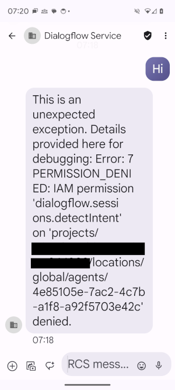

# Dialogflow Integration Module for Google RCS Business Messaging

This code implements an integration model to connect Dialogflow to Google
[RCS Business Messaging](https://developers.google.com/business-communications/rcs-business-messaging).
See release notes below for details of current support. Feel free to extend this code for your needs.

The module can be deployed as a Cloud Run sevice in your Dialogflow Google Cloud project:


It will be registered as an RBM agent and receive webhook calls from RBM containing inbound
RBM messages. It passes these on to your Dialogflow agent and sends responses back using
the RBM developer API.

Alternatively, this module can be deployed into AppEngine.


## Initial Setup

Prepare credentials:

1. Open the RBM Developer Console (https://business-communications.cloud.google.com/console/partner-console/)
with your RBM Platform Google account and create a new RBM agent.

2. When the agent is available, click the agent's card.

3. In the left navigation, click **Service account**.

4. Click **Create key**, then click **Create**. Your browser downloads a service account key for your agent. You need this key to make RBM API calls as your agent.

5. Edit `resources/rbm-agent-service-account-credentials.json` and paste the JSON key structure here.

Set your configuration:

1. Edit `/resources/config.json`.

2. Add the string you want to use for RBM webhook verification.

3. Add your Dialogflow model information.


## Choose your deployment model

The preferred opton is to deploy this module as a Cloud Run service - the model that is used for other [DialogFlow
integration modules](https://github.com/GoogleCloudPlatform/dialogflow-integrations). However, Google RBM
webhooks implement their own [authentication model](https://developers.google.com/business-communications/rcs-business-messaging/guides/integrate/pubsub#push-setup)
which requires that the Cloud Run service be configured for unauthenticated access.

If this is not possible in your environment then the module can alternatively be deployed into AppEngine.

The module can be deployed directly into your Dialogflow-enabled Google Cloud Project. 

## Deploying the Integration Using Cloud Run

From this folder, run the following command:

```shell
gcloud config set project <project id>
```

Now deploy the service with this command:

```shell
gcloud run deploy rbm-integration-module --source .
```

You will need to select a hosting region and will be presented with the command to make this the default for future deployments.

Confirm you will accept unauthenticated requests - RBM has its
[own authentication mechanism](https://developers.google.com/business-communications/rcs-business-messaging/guides/integrate/pubsub#verify_incoming_messages)
to secure webhooks. 

You may be prompted to enable additional APIs in your GCP project. Select `y` to install these (charges may apply).

Note the **Service URL** - you will need this later.

As a sanity check, open the URL in your browser to confirm you do not receive a `400 FORBIDDEN` response - this would indicate
you can not configure this service for [unauthenticated access](https://cloud.google.com/run/docs/authenticating/public)
and you will need to deploy in AppEngine.

More information can be found in Cloud Run
[documentation](https://cloud.google.com/run/docs/deploying).

You can view a list of your active integration deployments under [Cloud Run](https://console.cloud.google.com/run) in the GCP Console.


## Deploying the Integration into App Engine

You will need to use this deployment option if your environment does not allow you to configure a Cloud Run service
for [unauthenticated access](https://cloud.google.com/run/docs/authenticating/public).

```shell
gcloud app deploy
```

- you will be asked for a hosting region when you first deploy
- note the **target URL** and **target service account** - you will need these later

## Stage 2 setup

Having configured and deployed the integration model in the steps above:

Complete RBM configuration by validating your webhook:

1. Open the RBM Developer Console (https://business-communications.cloud.google.com/console/partner-console/)
with your RBM Platform Google account and create a new RBM agent.

2. Select your RBM agent.

3. In the left navigation, click **Integrations**.

4. Click either **Cloud Pub/Sub** or **Webhook**.

5. Click **Edit subscription**.

6. Select **Push** and **Edit**.

7. Enter the URL you noted from the deployment step above.

8. Enter the token you used in your configuration file above (or copy the token displayed, add it to your config file and redeploy).

9. Select **Verify** and **Save** once this completes successfully.

Ensure Dialogflow can be called by the integration model.


## Deploying into a different GCP project

You will need to take the followign steps if you deploy this module into a GCP project that is not the
one containing your Dialogflow agent:

1. Enable the [Dialogflow API](https://console.developers.google.com/apis/api/dialogflow.googleapis.com/) in the project.
2. Ensure that the Service Account the module is running under is able to invoke your Dialogflow agent - see
**IAM permission denied** below.

## Testing

1. Open the RBM Developer Console (https://business-communications.cloud.google.com/console/partner-console/),
   select your agent and invite your RCS-enabled device to become a tester.
2. Accept the tester invite once it arrives.
3. Return to the RBM Developer Console and send your device a test message.

You will now see this message on your device. Keep this conversation in your history - any messages you
enter here will now go to your Dialogflow agent and you will receive the response.

## Dialogflow custom payload templates

`dialogflow-templates/` contains templates that you can add to youer Dialogflow project. These define the
message formats currently supported by this integration model.

## Further thoughts

Beyond testing, you need to think about now the initial engagement between your Dialogflow agent and 
an RCS user will take place. 

## Debugging

### IAM permission denied

If you see this response when you send a message to your model:



You deployed into AppEngine and the integration module does not have access to call your Dialogflow model. 

1. Open the [Dialogflow console](https://dialogflow.cloud.google.com/).
2. Select your project and agent.
3. Click **Agent Settings** and **Share**.
4 Add the the Service Account you noted previously (from the AppEngine deployment). You will need to add the additional Role **Dialogflow Client**.

### Messages are not being displayed

Is your Dialogflow agent returning content that is not yet supported? You will need to update the `handleDialogflowResponse`
function  in `server.js` - or contact us.

### I see "I can't understand that"

The current implementation only forwards text RBM messages to the Dialogflow agent. You will need 
to extend `processRbmEvent` in `server.js` - or contact us.

## Release notes

**v1**

- supports text, RichCard and File Transfers from Dialogflow to RBM
- supports text content from RBM to Dialogflow
